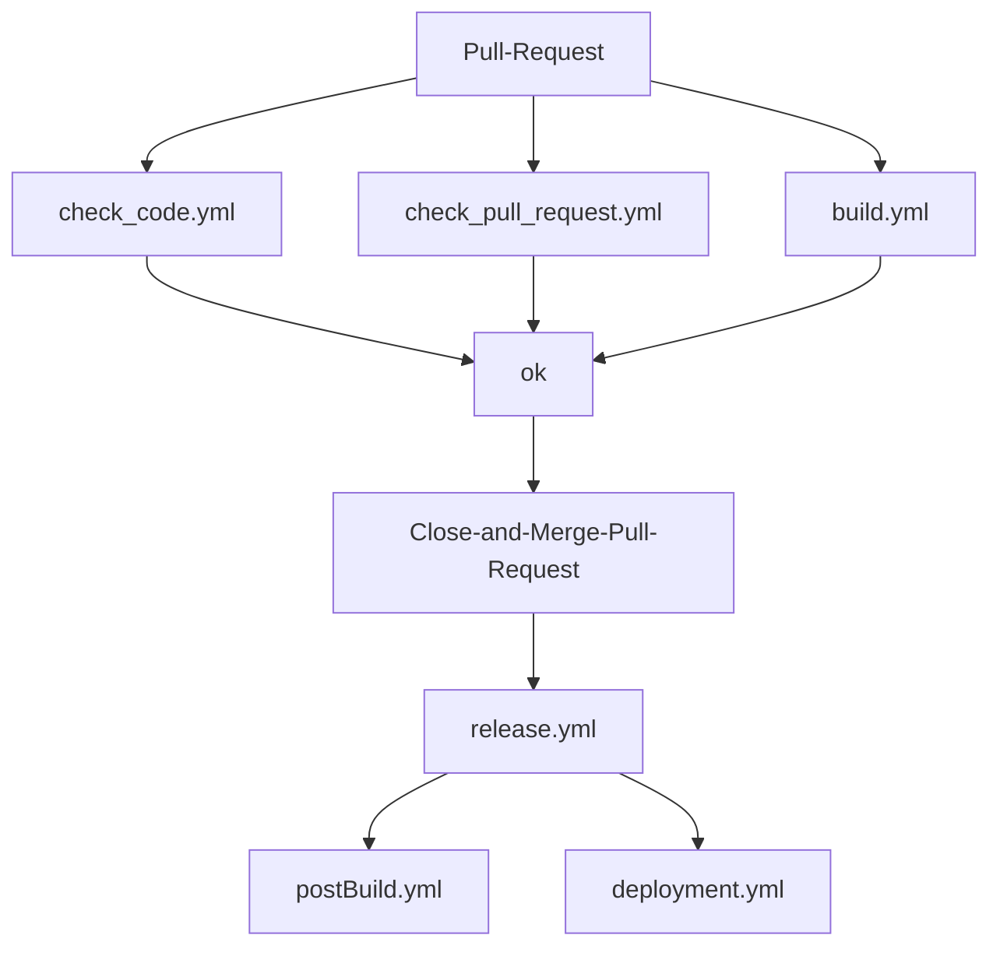

# Neue Release-Pipeline

## Inhaltsverzeichnis

* [Neue Release-Pipeline](#neue-release-pipeline)
  * [Features der neuen automatischen CICD-Pipeline](#features-der-neuen-automatischen-cicd-pipeline)
  * [Allgemeiner Ablauf](#allgemeiner-ablauf)
  * [Workflows](#workflows)
  * [Installation](#installation)
    * [Main Branch aktualisieren](#main-branch-aktualisieren)
    * [GitHub Repo Einstellungen](#github-repo-einstellungen)
    * [Anpassung der distribute.yml](#anpassung-der-distributeyml)
    * [Anpassung im Microservice](#anpassung-im-microservice)
      * [Anpassung eines CA-Projektes](#anpassung-eines-ca-projektes)
      * [Anpassung eines Projektes mit alter CA Struktur](#anpassung-eines-projektes-mit-alter-ca-struktur)
      * [Anpassung eines nicht-CA-projektes](#anpassung-eines-nicht-ca-projektes)
    * [Anpassung des GitHub Repo mit offenem Pull-Request](#anpassung-des-github-repo-mit-offenem-pull-request)
    * [DOGS melden](#dogs-melden)
    * [Renovate Assignee Verteilung überarbeiten](#renovate-assignee-verteilung-überarbeiten)

## Features der neuen automatischen CICD-Pipeline

* Nach jedem PR wird ein Release gebaut und auf Dev deployt
* Automatische Berechnung einer Release-Version
* Einbau weiterer Prüfungen im Pull-Request
  * Code-Diff wird auf Markierungen "TODO,FIXME,BUG,DOCME,DEPRECATED" geprüft
  * Pull-Request-Labels werden mit Jira synchronisiert, um automatisch ms-configuration:yes oder ms-deployment:yes zu
      setzen
    * Wenn eines der beiden Labels mit ":yes" gesetzt wird, dann gibt es eine Meldung an DOGS (Dispatching and OnGoing Support)
      und in den Release-Notes, um mitzuteilen, dass Konfigurationsänderungen während des Deployments notwendig sind. Diese Mitteilung erfolgt über eine Meldung per '@freenet-group/abr-ms-gh-deployments' Markierung.
  * Prüfung auf release labels: release:patch, release:minor, release:major über das Semantic Version Feld aus Jira
* Automatische Erstellung von Release-Notes im GitHub-Release und nicht mehr als Wiki-Seite
* Bambi-Notification (Meldung über neue Releases) beinhaltet nun auch Release-Informationen und eine Info, ob es ein
  Renovate-Release ist
* Deployment-Scripte wurden zusammengefasst
* Einbau von SBOM(Software Bill of Material)-Meldungen

## Allgemeiner Ablauf



## Workflows

| Workflow | Beschreibung |
| -------- | ------------ |
| build.yml | Baut das Projekt und führt die Tests aus |
| check_code.yml | Prüft den Code auf UTF und Markierungen. Bei Auffäligkeiten wird ein Kommentar erstellt. |
| check_pull_request.yml | Synchronisiert die Labels mit unserem ABRMS/MCBS-Jira-Projekt. Danach wird auf Pflichtlabels geprüft und gegebenfalls Bambi (API) und DOGS (@freenet-group/abr-ms-gh-deployments) informiert. Auch hier wird bei Auffälligkeiten ein Kommentar erstellt. |
| release.yml | Erstellt ein Release mit Release-Notes und deployt das Release auf DEV |
| postBuild.yml | Verteilt die Release-Information an Jira und Teams |
| deployment.yml | Deployt das Projekt auf der gewählten Umgebung für VM und K8s. Nach dem Deployment erfolgt ein Sanity-Test. Im Anschluss wird ein SBOM-File mit der jeweiligen Version und Environment hochgeladen und Bambi informiert. |

## Installation

🛑 Es ist nicht möglich, einfach nur den Microservice in der distribute.yml umzuhängen.
Sollten Probleme auftreten, dann bitte die alte distribute.yml wiederherstellen und Problem bei den GitHub / CICD Leuten melden.

### Main Branch aktualisieren

* Repo mit Main Branch ausschecken
* Develop Branch reinziehen
* Direkt ohne PR commiten

### GitHub Repo Einstellungen

* settings:
  * General
    * Default-Branch auf "main" setzen. Im neuen Ablauf wird nach jedem Merge eine neue Version gebaut, somit ist kein "develop"- oder "release"-Branch mehr notwendig
  * Labels
    * Labels sind ein wenig versteckt, können aber unter Issues->Labels gefunden werden
    * Folgende Labels anlegen oder Farben anpassen:
      * release:major mit Color #B60205 🔴
      * release:minor mit Color #FBCA04 🟡
      * release:patch mit Color #0E8A16 🟢
      * ms-configuration:no
      * ms-deployment:no
      * aws-parameterstore:no
      * ms-configuration:yes
      * ms-deployment:yes
      * aws-parameterstore:yes

### Anpassung der distribute.yml

Im Repo mcbscore-github-action muss der Workflow distribute.yml mit einen eigenen Branch angepasst werden:

* Hierzu den jeweiligen Microservice aus der "ms" Gruppe in die "ms-cicd" Gruppe verschieben
  * Branch auf "main" setzen
  * Die Gruppe unter "strategy.matrix.repository.group" muss von "ms" auf "ms-cicd" geändert werden
  * Die Workflows müssen gegen den env.DEFAULT_WORKFLOWS geprüft werden und können danach ebenfalls entfernt werden
* Im Anschluss den Workflow unter github->actions->workflows->distribute.yml mit dem Branch und der Gruppe ms-cicd verteilen

* Unter der spotless Verteilung muss der Branch von "develop" auf "main" geändert werden.

* Nach Abschluss des Umbau und Tests kann dieser PR ebenfalls gemerged werden.

### Anpassung im Microservice
#### Anpassung eines CA-Projektes
(zu erkennen an folgendem Plugin in der build.gradle: de.freenet.cleanArchitecture)

Hierzu sollte ein Branch mit PR für den SBOM-Einbau gemacht werden. Dann wird auch gleich ein Release erstellt.

Dieser Teil der Anleitung ist für unsere auf Clean Architecture basierenden Microservices. Für alle Anderen gibt es
unten einen eigenen Abschnitt.

* Prüfen, ob das Distribute die korrekten Workflows verteilt hat oder im Branch die Workflows vorhanden sind
* gradle.properties mit .github/workflow.properties vergleichen
  * ARTIFACT_GROUP_ID und COVERAGE_PATH müssen identisch sein
  * ARTIFACT_NAME und COVERAGE_APP müssen identisch sein
  * Wenn eines dieser beiden Konfigurationen nicht vorhanden ist, wird Sonar keine Coverage finden und somit 0%
      melden. Dasselbe passiert, wenn die Sonar-URL unter den AWS-Parametern fehlt.
* workflow.properties erweitern

    ```properties
    #...
    DEPENDENCYTRACK_BOM_PATH=./build/reports/
    DEPENDENCYTRACK_BOM_NAME=bom.json
    ```

* gradle/cyclonedx.gradle prüfen, ob vorhanden
  * Wenn nicht vorhanden:
    * config unter gradle/cyclonedx.gradle einfügen: [MS-CICD Beispiel](https://github.com/freenet-group/ms-cicd/blob/main/gradle/cyclonedx.gradle)
    * cyclonedx-gradle-plugin in der build.gradle hinzufügen

    ```groovy
    plugins {
        //...
        id 'org.cyclonedx.bom' version '1.8.2'
    }

    // Ganz im apply from: Block unten hinzufügen
    apply from: './gradle/cyclonedx.gradle'
    ```

* gradle/sonar.gradle prüfen, ob folgende Werte gesetzt sind

    ```groovy
    //...
    property "sonar.projectName", project.ARTIFACT_NAME
    property "sonar.projectKey", "$project.ARTIFACT_GROUP_ID:$project.ARTIFACT_NAME"
    property "sonar.sourceEncoding", project.FILE_ENCODING
    property "sonar.projectVersion", project.ARTIFACT_VERSION
    //...
    ```
* Sicherstellen, daß in folgendem Block korrekt auf das Release und nicht mehr auf das wiki verwiesen wird. Das Property ist in "release_notes" umzubenennen, falls es noch nicht so heißt. Das Property, welches auf den Workflow Run des Release Builds verweist, ist in release_build umzubenennen, falls es noch nicht so heißt. REPO_NAME ist bei beiden durch den Namen des Repositories zu ersetzen.
    ```groovy
    springBoot {
      buildInfo {
        properties {
          additional = [
            'release_notes': 'https://github.com/freenet-group/REPO_NAME/releases/tag/' + project.ARTIFACT_VERSION,
            'release_build': 'https://github.com/freenet-group/REPO_NAME/actions/runs/' + (System.getenv("GITHUB_RUN_ID") != null? System.getenv("GITHUB_RUN_ID"): "unknown")
    ```

#### Anpassung eines Projektes mit alter CA Struktur
(zu erkennen am Fehlen des folgenden Plugins in der build.gradle: de.freenet.cleanArchitecture)

Hierzu sollte ein Branch mit PR für den SBOM-Einbau gemacht werden. Dann wird auch gleich ein Release erstellt.

Dieser Teil der Anleitung ist für unsere auf Clean Architecture basierenden Microservices. Für alle Anderen gibt es
unten einen eigenen Abschnitt.

* Prüfen, ob das Distribute die korrekten Workflows verteilt hat oder im Branch die Workflows vorhanden sind
* gradle.properties mit .github/workflow.properties vergleichen
  * ARTIFACT_GROUP_ID und COVERAGE_PATH müssen identisch sein
  * ARTIFACT_NAME und COVERAGE_APP müssen identisch sein
  * Wenn eines dieser beiden Konfigurationen nicht vorhanden ist, wird Sonar keine Coverage finden und somit 0%
    melden. Dasselbe passiert, wenn die Sonar-URL unter den AWS-Parametern fehlt
* workflow.properties erweitern (<b>zu BEACHTEN:</b> Das erste Unterverzeichnis im DEPENDENCYTRACK_BOM_PATH ist servicespezifisch und entsprechend anzupassen). Sicherstellen, dass APPLICATION_JAR_NAME sich aus "ms-" und COMPONENT zusammensetzt

  ```properties
  # .. 
  APPLICATION_JAR_NAME=ms-test
  COMPONENT=test
  DEPENDENCYTRACK_BOM_PATH=./mark-application/application/spring-boot/build/reports/
  DEPENDENCYTRACK_BOM_NAME=bom.json
  ```

* gradle/cyclonedx.gradle prüfen, ob vorhanden
  * Wenn nicht vorhanden:
    * config unter gradle/cyclonedx.gradle einfügen
      ```groovy
      apply plugin: 'org.cyclonedx.bom'
      
      cyclonedxBom {
        // includeConfigs is the list of configuration names to include when generating the BOM (leave empty to include every configuration)
        includeConfigs = ["runtimeClasspath"]
        // skipConfigs is a list of configuration names to exclude when generating the BOM
        skipConfigs = ["compileClasspath", "testCompileClasspath"]
        // Specified the type of project being built. Defaults to 'library'
        projectType = "application"
        // Specified the version of the CycloneDX specification to use. Defaults to 1.4.
        schemaVersion = "1.4"
        // The file name for the generated BOMs (before the file format suffix).
        outputName = "bom"
        // The file format generated, can be xml, json or all for generating both
        outputFormat = "json"
        // Exclude BOM Serial Number
        includeBomSerialNumber = false
        // Override component version
        componentVersion = "local"
      }
      
      tasks.processResources.dependsOn(cyclonedxBom)
      ```
    * cyclonedx-gradle-plugin in der build.gradle hinzufügen (ohne apply)
      ```groovy
      plugins {
        //...
        id 'org.cyclonedx.bom' version '1.8.2' apply false
      }
      ```
    * im build.gradle der Applikation folgendes oben bei den apply Anweisungen ergänzen
      ```groovy
      apply from: "${rootDir}/gradle/cyclonedx.gradle"  
      ```

* gradle/sonar.gradle prüfen, ob folgende Werte gesetzt sind

    ```groovy
    //...
    property "sonar.projectName", project.ARTIFACT_NAME
    property "sonar.projectKey", "$project.ARTIFACT_GROUP_ID:$project.ARTIFACT_NAME"
    property "sonar.sourceEncoding", project.FILE_ENCODING
    property "sonar.projectVersion", project.ARTIFACT_VERSION
    //...
    ```
* Sicherstellen, daß in folgendem Block korrekt auf das Release und nicht mehr auf das wiki verwiesen wird. Das Property ist in "release_notes" umzubenennen, falls es noch nicht so heißt. Das Property, welches auf den Workflow Run des Release Builds verweist, ist in release_build umzubenennen, falls es noch nicht so heißt. REPO_NAME ist bei beiden durch den Namen des Repositories zu ersetzen.
    ```groovy
    springBoot {
      buildInfo {
        properties {
          additional = [
            'release_notes': 'https://github.com/freenet-group/REPO_NAME/releases/tag/' + project.ARTIFACT_VERSION,
            'release_build': 'https://github.com/freenet-group/REPO_NAME/actions/runs/' + (System.getenv("GITHUB_RUN_ID") != null? System.getenv("GITHUB_RUN_ID"): "unknown")
    ```
* In derselben build.gradle Datei muß zusätzlich folgendes gemacht werden
  * Folgender Block muß vorhanden sein
      ```groovy
      //...
      jar.enabled = false

      bootJar {
          // Sets output jar name
          archiveFileName = "${project.ARTIFACT_NAME}-${project.ARTIFACT_VERSION}.${archiveExtension.get()}"
          duplicatesStrategy = DuplicatesStrategy.INCLUDE
      }
      ```
  * Folgende Properties sind zu entfernen
    ```groovy
    archivesBaseName = ...
    group = project.ARTIFACT_GROUP_ID
    version = rootProject.version 
    ```
  * Wenn vorhanden, ist der publishing Block zu entfernen

#### Anpassung eines nicht-CA-projektes

Hierzu sollte ein Branch mit PR für den SBOM-Einbau gemacht werden. Dann wird auch gleich ein Release erstellt.

* Prüfen, ob das Distribute die korrekten Workflows verteilt hat oder im Branch die Workflows vorhanden sind
* workflow.properties erweitern und sicherstellen, dass APPLICATION_JAR_NAME sich aus "ms-" und COMPONENT zusammensetzt

    ```properties
    #...
    APPLICATION_JAR_NAME=ms-test
    COMPONENT=test
    DEPENDENCYTRACK_BOM_PATH=./build/reports/
    DEPENDENCYTRACK_BOM_NAME=bom.json
    ```

* gradle.properties prüfen, sodass ARTIFACT_NAME und APPLICATION_JAR_NAME identisch sind

  ```properties
  #...
  ARTIFACT_NAME=ms-test
  ```

* cyclonedx-gradle-plugin in der build.gradle hinzufügen

    ```groovy
    plugins {
        //...
        id 'org.cyclonedx.bom' version '1.8.2'
    }

    //...

    cyclonedxBom {
        // includeConfigs is the list of configuration names to include when generating the BOM (leave empty to include every configuration)
        includeConfigs = ["runtimeClasspath"]
        // skipConfigs is a list of configuration names to exclude when generating the BOM
        skipConfigs = ["compileClasspath", "testCompileClasspath"]
        // Specified the type of project being built. Defaults to 'library'
        projectType = "application"
        // Specified the version of the CycloneDX specification to use. Defaults to 1.4.
        schemaVersion = "1.4"
        // The file name for the generated BOMs (before the file format suffix).
        outputName = "bom"
        // The file format generated, can be xml, json or all for generating both
        outputFormat = "json"
        // Exclude BOM Serial Number
        includeBomSerialNumber = false
        // Override component version
        componentVersion = "local"
    }
    ```
* Sicherstellen, daß in folgendem Block korrekt auf das Release und nicht mehr auf das wiki verwiesen wird. Das Property ist in "release_notes" umzubenennen, falls es noch nicht so heißt. Das Property, welches auf den Workflow Run des Release Builds verweist, ist in release_build umzubenennen, falls es noch nicht so heißt. REPO_NAME ist bei beiden durch den Namen des Repositories zu ersetzen.
    ```groovy
    springBoot {
      buildInfo {
        properties {
          additional = [
            'release_notes': 'https://github.com/freenet-group/REPO_NAME/releases/tag/' + project.ARTIFACT_VERSION,
            'release_build': 'https://github.com/freenet-group/REPO_NAME/actions/runs/' + (System.getenv("GITHUB_RUN_ID") != null? System.getenv("GITHUB_RUN_ID"): "unknown")
    ```

* Ausser bei Libs/Apis kann der ganze Block "publishing" entfernt werden
  * "id 'maven-publish'" muss aber bleiben

* bootJar-block in der build.gradle hinzufügen

    ```groovy
    //...
    jar.enabled = false

    bootJar {
        // Sets output jar name
        archiveFileName = "${project.ARTIFACT_NAME}-${project.ARTIFACT_VERSION}.${archiveExtension.get()}"
        duplicatesStrategy = DuplicatesStrategy.INCLUDE
    }
    ```

* "gradlew clean build" müsste ein sbom file nun erzeugen

### Anpassung des GitHub Repo mit offenem Pull-Request

* settings:
  * Branches
    * "Branch Protection Rules" für "main" anlegen und folgende Einträge setzen:
      * Require pull request reviews before merging
      * Require approvals 1
      * Dismiss stale pull request approvals when new commits are pushed
      * Require status checks to pass before merging
      * Require branches to be up to date before merging
      * Status checks that are required
        * build, checkLabels
          * build -> Job in der build.yml
          * checkLabels -> Job in der check_pull_request.yml
            * Alle 4 checkLabels WF

Der PR dürfte nun auf ein Approval und auf die erfolgreichen Checks bestehen

Im PR müssen nun die Labels "release:patch", "ms-configuration:no", "ms-deployment:no" und "aws-parameterstore:no" gesetzt werden.

PR mergen. Release Workflow abwarten und dann Release Notes prüfen und ggf. von Hand korrigieren. (Bei Umstellung von alten auf CICD Workflows mit Aktualisierung des main-Branches können vermeintlich betroffene Tickets ermitteln werden, die zu löschen sind.)

In den Releases das letzte SNAPSHOT-Release löschen

### DOGS melden

DOGS Bescheid geben, dass der Deployment Branch geändert wird.

### Renovate Assignee Verteilung überarbeiten

Im [Renovate Assignee Repo](https://github.com/freenet-group/mcbscore-renovate/blob/main/renovate-assignees.json) muss der Branch von 'develop' auf 'main' geändert werden.
