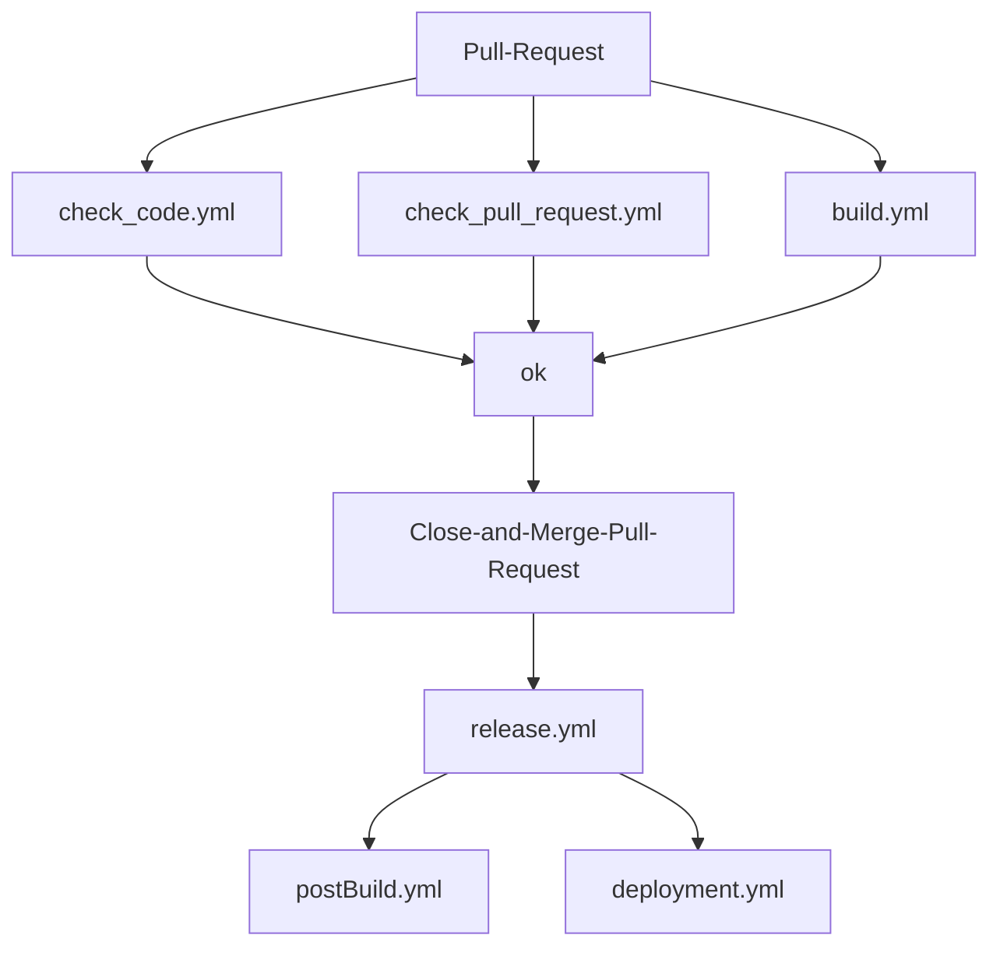

# Neue Release-Pipeline

## Inhaltsverzeichnis

* [Neue Release-Pipeline](#neue-release-pipeline)
  * [Features der neuen automatischen CICD-Pipeline](#features-der-neuen-automatischen-cicd-pipeline)
  * [Allgemeiner Ablauf](#allgemeiner-ablauf)
  * [Workflows](#workflows)
  * [Installation](#installation)
    * [Anpassung der distribute.yml](#anpassung-der-distributeyml)
    * [Anpassung des GitHub Repo](#anpassung-des-github-repo)
    * [Anpassung eines CA-Projektes](#anpassung-eines-ca-projektes)
    * [Anpassung eines nicht-CA-Projektes wie ms-contentprovider](#anpassung-eines-nicht-ca-projektes)

## Features der neuen automatischen CICD-Pipeline

* Nach jedem PR wird ein Release gebaut und auf Dev deployt
* Automatische Berechnung einer Release-Version
* Einbau weiterer Prüfungen im Pull-Request
  * Code-Diff wird auf Markierungen "TODO,FIXME,BUG,DOCME,DEPRECATED" geprüft
  * Pull-Request-Labels werden mit Jira synchronisiert, um automatisch ms-configuration:yes oder ms-deployment:yes zu
      setzen
    * Wenn eines der beiden Labels mit ":yes" gesetzt wird, dann gibt es eine Meldung an DOGS (Dispatching and OnGoing Support)
      und in den Release-Notes, um mitzuteilen, dass Konfigurationsänderungen während des Deployments notwendig sind. Diese Mitteilung erfolgt über eine Meldung per '@freenet-group/abr-ms-gh-deployments' Markierung.
  * Prüfung auf release labels: release:patch, release:minor, release:major über das Semantic Version Feld aus Jira
* Automatische Erstellung von Release-Notes im GitHub-Release und nicht mehr als Wiki-Seite
* Bambi-Notification (Meldung über neue Releases) beinhaltet nun auch Release-Informationen und eine Info, ob es ein
  Renovate-Release ist
* Deployment-Scripte wurden zusammengefasst
* Einbau von SBOM(Software Bill of Material)-Meldungen

## Allgemeiner Ablauf



## Workflows

| Workflow | Beschreibung |
| -------- | ------------ |
| build.yml | Baut das Projekt und führt die Tests aus |
| check_code.yml | Prüft den Code auf UTF und Markierungen. Bei Auffäligkeiten wird ein Kommentar erstellt. |
| check_pull_request.yml | Synchronisiert die Labels mit unserem ABRMS/MCBS-Jira-Projekt. Danach wird auf Pflichtlabels geprüft und gegebenfalls Bambi (API) und DOGS (@freenet-group/abr-ms-gh-deployments) informiert. Auch hier wird bei Auffälligkeiten ein Kommentar erstellt. |
| release.yml | Erstellt ein Release mit Release-Notes und deployt das Release auf DEV |
| postBuild.yml | Verteilt die Release-Information an Jira und Teams |
| deployment.yml | Deployt das Projekt auf der gewählten Umgebung für VM und K8s. Nach dem Deployment erfolgt ein Sanity-Test. Im Anschluss wird ein SBOM-File mit der jeweiligen Version und Environment hochgeladen und Bambi informiert. |

## Installation

🛑 Es ist nicht möglich, einfach nur den Microservice in der distribute.yml umzuhängen.
Sollten Probleme auftreten, dann bitte die alte distribute.yml wiederherstellen und Problem bei den GitHub / CICD Leuten melden.

## Ablauf

### Main Branch aktualisieren

* Repo mit Main Branch ausschecken
* Develop Branch reinziehen
* Direkt ohne PR commiten

### GitHub Repo Einstellungen

* settings:
  * General
    * Default-Branch auf "main" setzen. Im neuen Ablauf wird nach jedem Merge eine neue Version gebaut, somit ist kein "develop"- oder "release"-Branch mehr notwendig
      * 🛑 DOGS muss Ihr Deployment Script für den Branch anpassen
    * Wikis "kann" deaktiviert werden. Release Notes erfolgen jetzt direkt im Release.
  * Labels
    * Labels sind ein wenig versteckt, können aber unter Issues->Labels gefunden werden
    * Folgende Labels anlegen oder Farben anpassen:
      * release:major mit Color #B60205 🔴
      * release:minor mit Color #FBCA04 🟡
      * release:patch mit Color #0E8A16 🟢

### Anpassung der distribute.yml

Im Repo mcbscore-github-action muss der Workflow distribute.yml angepasst werden:

* Hierzu den jeweiligen Microservice aus der "ms" Gruppe in die "ms-cicd" Gruppe verschieben
* Im Anschluss den Workflow unter github->actions->workflows->distribute.yml mit der Gruppe ms-cicd verteilen

Alternativ:

* Workflows aus workflows->ms-cicd in das Projekt kopieren
* actions/templates in das Projekt unter .github/actions/templates kopieren
* 🛑 Nach Umstellung die distribute.yml trotzdem anpassen, da ansonsten am nächsten Verteiltag die Workflows wieder überschrieben werden

### Anpassung eines CA-Projektes

Dieser Teil der Anleitung ist für unsere auf Clean Architecture basierenden Microservices. Für alle Anderen gibt es
unten einen eigenen Abschnitt.

* Prüfen, ob das Distribute die korrekten Workflows verteilt hat oder im Branch die Workflows vorhanden sind
* gradle.properties mit .github/workflow.properties vergleichen
  * ARTIFACT_GROUP_ID und COVERAGE_PATH müssen identisch sein
  * ARTIFACT_NAME und COVERAGE_APP müssen identisch sein
  * Wenn eines dieser beiden Konfigurationen nicht vorhanden ist, wird Sonar keine Coverage finden und somit 0%
      melden. Dasselbe passiert, wenn die Sonar-URL unter den AWS-Parametern fehlt.
* workflow.properties erweitern

    ```properties
    #...
    DEPENDENCYTRACK_BOM_PATH=./build/reports/
    DEPENDENCYTRACK_BOM_NAME=bom.json
    ```

* gradle/cyclonedx.gradle prüfen, ob vorhanden
  * Wenn nicht vorhanden:
    * config unter gradle/cyclonedx.gradle einfügen: [MS-CICD Beispiel](https://github.com/freenet-group/ms-cicd/blob/main/gradle/cyclonedx.gradle)
    * cyclonedx-gradle-plugin in der build.gradle hinzufügen

    ```groovy
    plugins {
        //...
        id 'org.cyclonedx.bom' version '1.7.4'
    }

    // Ganz im apply from: Block unten hinzufügen
    apply from: './gradle/cyclonedx.gradle'
    ```

* gradle/sonar.gradle prüfen, ob folgende Werte gesetzt sind

    ```groovy
    //...
    property "sonar.projectName", project.ARTIFACT_NAME
    property "sonar.projectKey", "$project.ARTIFACT_GROUP_ID:$project.ARTIFACT_NAME"
    property "sonar.sourceEncoding", project.FILE_ENCODING
    property "sonar.projectVersion", project.ARTIFACT_VERSION
    //...
    ```

### Anpassung eines nicht-CA-projektes

Als Beispiel hierzu wurde ms-contentprovider umgebaut.

* Prüfen, ob das Distribute die korrekten Workflows verteilt hat oder im Branch die Workflows vorhanden sind
* workflow.properties erweitern

    ```properties
    #...
    DEPENDENCYTRACK_BOM_PATH=./build/reports/
    DEPENDENCYTRACK_BOM_NAME=bom.json
    ```

* cyclonedx-gradle-plugin in der build.gradle hinzufügen

    ```groovy
    plugins {
        //...
        id 'org.cyclonedx.bom' version '1.7.4'
    }

    //...

    // ganz unten dann diesen Block hinzufügen
    tasks.named("build") { finalizedBy("cyclonedxBom") }

    cyclonedxBom {
        // includeConfigs is the list of configuration names to include when generating the BOM (leave empty to include every configuration)
        includeConfigs = ["runtimeClasspath"]
        // skipConfigs is a list of configuration names to exclude when generating the BOM
        skipConfigs = ["compileClasspath", "testCompileClasspath"]
        // Specified the type of project being built. Defaults to 'library'
        projectType = "application"
        // Specified the version of the CycloneDX specification to use. Defaults to 1.4.
        schemaVersion = "1.4"
        // The file format generated, can be xml, json or all for generating both
        outputFormat = "json"
        // Exclude BOM Serial Number
        includeBomSerialNumber = false
        // Override component version
        componentVersion = "local"
    }
    ```

* bootJar-block in der build.gradle hinzufügen

    ```groovy
    //...
    jar.enabled = false

    bootJar {
        // Sets output jar name
        archiveFileName = "${project.getParent().getName()}-${project.ARTIFACT_VERSION}.${archiveExtension.get()}"
        duplicatesStrategy = DuplicatesStrategy.INCLUDE
    }
    ```

### Anpassung des GitHub Repo mit offenem Pull-Request

Sofern Probot nicht genutzt wird, muss das GitHub Repo angepasst werden:

* settings:
  * Branches
    * "Branch Protection Rules" für "main" anlegen und folgende Einträge setzen:
      * Require pull request reviews before merging
      * Require approvals 1
      * Dismiss stale pull request approvals when new commits are pushed
      * Require status checks to pass before merging
      * Require branches to be up to date before merging
      * Status checks that are required
        * build, checkLabels
          * 🔴 Die Flows sind erst verfügbar, wenn das erste Release gebaut wurde
          * build -> Job in der build.yml
          * checkLabels -> Job in der check_pull_request.yml
